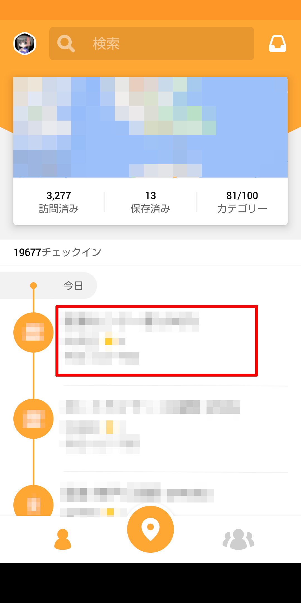
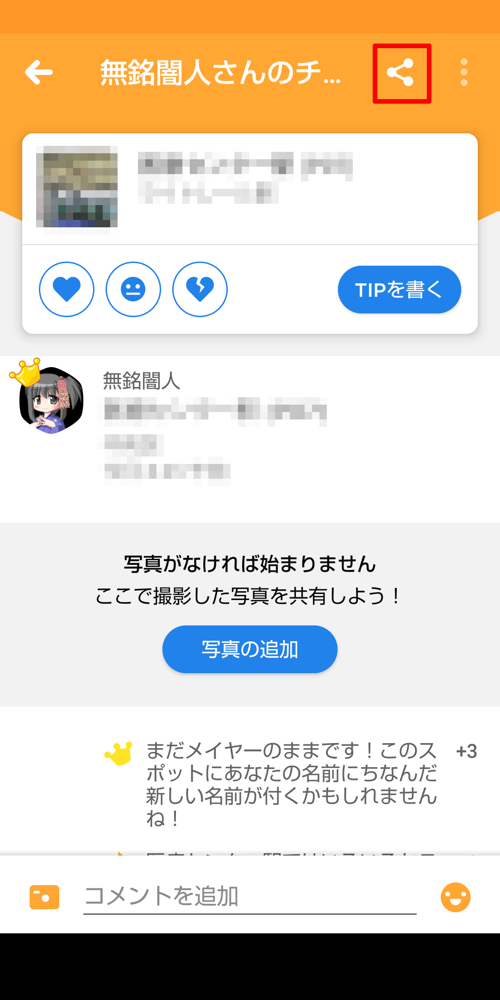
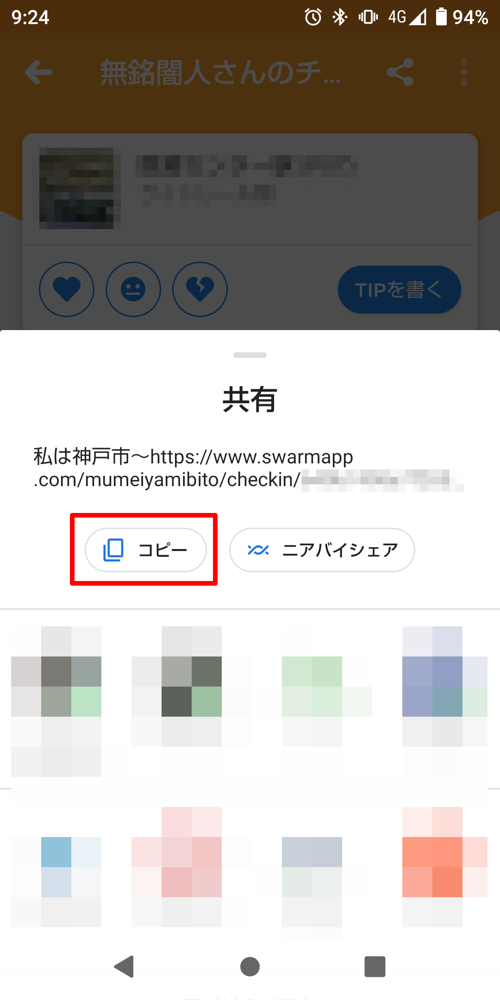

# swarmFormatter

## 概要
HTML to convert text for social networking service from a copy button on share menu of swarm app.

## 使用方法
1. Tap a venue on checkin list.  {#id .class width=30%}
1. Tap share button at top of venue page.  {#id .class width=30%}
1. Tap "Copy" button of shere menu.  {#id .class width=30%}
1. Open browser.
1. Access this HTML on your site. ([Demo](https://mumeiyamibito.0am.jp/~mumeiyamibito/swarmFormatter/swarmFormatter.html))
1. Paste text to textarea.
1. Tap "Convert & Copy to Clipboard".
1. Open social networking service app.
1. Paste text.

## 動作要件
* Web server

## License
The MIT License (MIT)

Copyright (c) 2023 mumeiyamibito

## Authors
* mumeiyamibito

## ChangeLog

### Ver. 1.1 (2023-02-01)
* Add "Clear" button.

### Ver. 1.0 (2023-02-01)
* Release this HTML.
